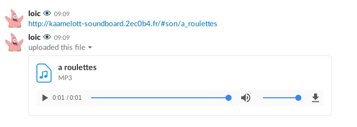
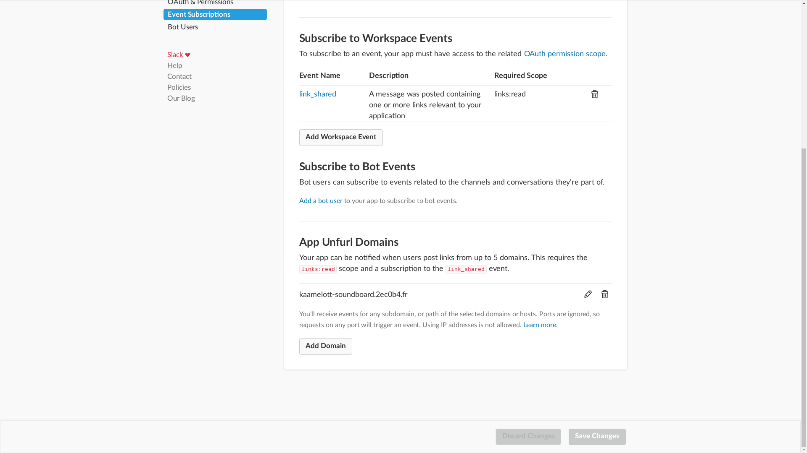
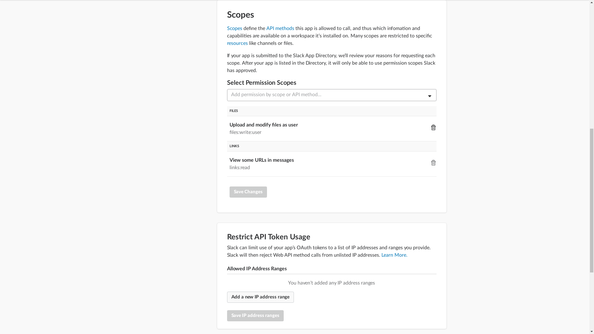

# Kaamelott Soundboard pour Slack !

## Introduction

Intégration Slack du [kaamelott soundboartd](http://kaamelott-soundboard.2ec0b4.fr/).



## Installation

Commencez par installer [yarn](https://yarnpkg.com/en/docs/install), puis utilisez `yarn` pour d'abord installer les dépendences :

```bash
yarn
```

Et ensuite lancez l'application avec `yarn start` :

```bash
yarn start
```

L'application est désormais disponible sur [localhost:3333](http://localhost:3333).

### Avec docker ?

Si vous voulez utiliser `docker`, commencez par installer `docker` et `docker-compose`, puis :
```bash
docker-compose up
```

Il faudra également ajouter dans un fichier `.env`, à la racine :
```
EXPOSED_PORT=3333
```

## Configuration

1. [Créer une application Slack](https://api.slack.com/apps?new_app=1),
2. Dans la section `Event subscription` ajouter le domaine [`kaamelott-soundboard.2ec0b4.fr`](http://kaamelott-soundboard.2ec0b4.fr) au niveau des `App Unfurl Domains`




3. Dans la section `OAuth & Permissions` Ajouter les droits `files:write:user` et `links:read`




4. Créer un fichier `.env` à la racine de l'application contenant le token `OAuth` de l'application Slack (il est affiché au début de la section `OAuth & Permissions`)

```
SLACK_TOKEN=YOUR_SLACK_TOKEN
```
